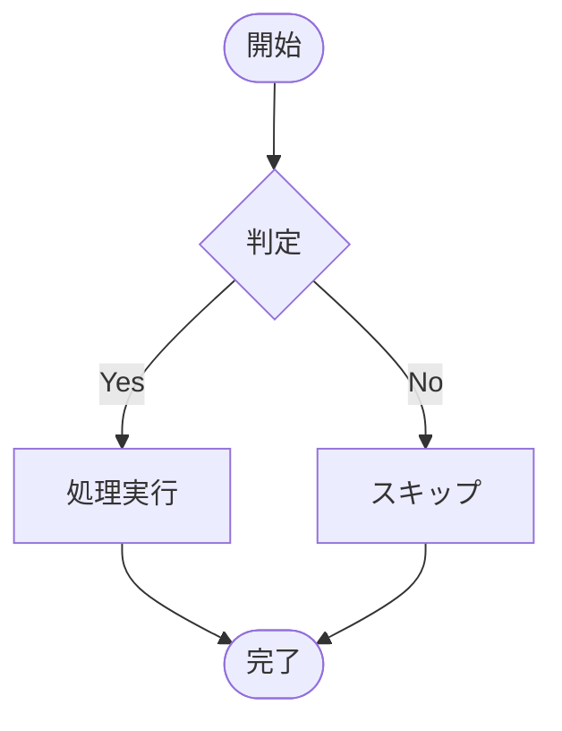
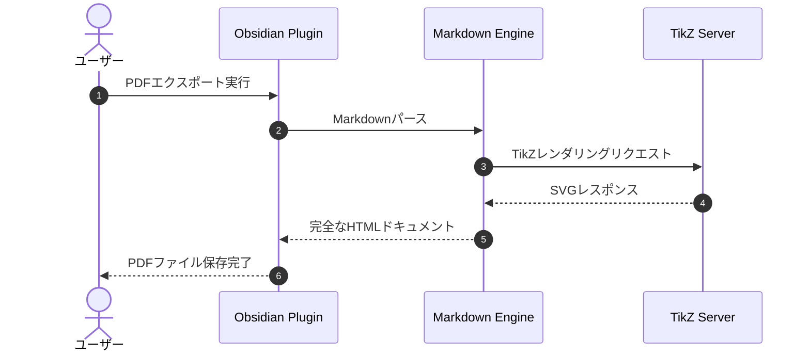
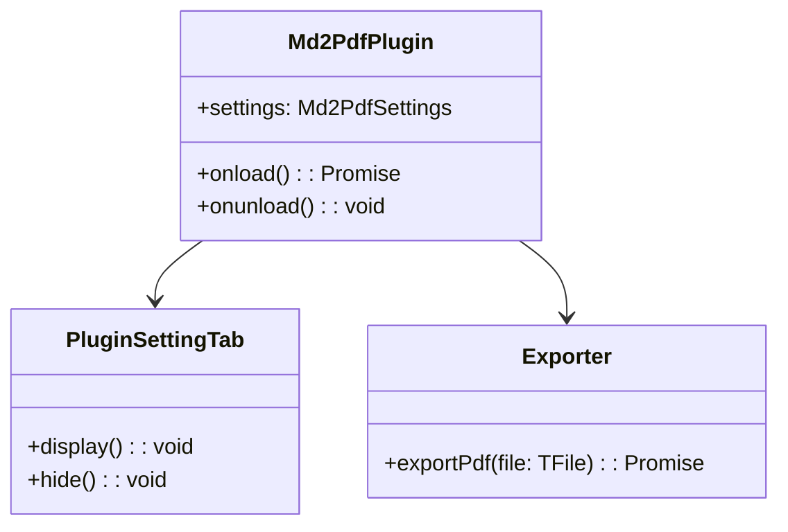
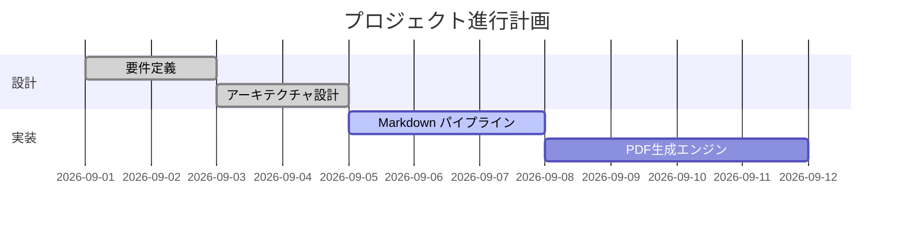

# Mermaid 描画サンプル

本プラグインでは、Mermaid.js をインプロセスで実行し、SVG に変換して PDF へ出力します。

## 1. フローチャート (Flowchart)

```mermaid
flowchart TD
    Start([開始]) --> Check{判定}
    Check -->|Yes| Process[処理実行]
    Check -->|No| Skip[スキップ]
    Process --> End([完了])
    Skip --> End
```

## 2. シーケンス図 (Sequence Diagram)

```mermaid
sequenceDiagram
    autonumber
    actor User as ユーザー
    participant Obsidian as Obsidian Plugin
    participant Renderer as Markdown Engine
    participant Server as TikZ Server

    User->>Obsidian: PDFエクスポート実行
    Obsidian->>Renderer: Markdownパース
    Renderer->>Server: TikZレンダリングリクエスト
    Server-->>Renderer: SVGレスポンス
    Renderer-->>Obsidian: 完全なHTMLドキュメント
    Obsidian-->>User: PDFファイル保存完了
```

## 3. クラス図 (Class Diagram)

```mermaid
classDiagram
    class PluginSettingTab {
        +display(): void
        +hide(): void
    }
    class Md2PdfPlugin {
        +settings: Md2PdfSettings
        +onload(): Promise<void>
        +onunload(): void
    }
    class Exporter {
        +exportPdf(file: TFile): Promise<void>
    }
    Md2PdfPlugin --> PluginSettingTab
    Md2PdfPlugin --> Exporter
```

## 4. ガントチャート (Gantt Chart)

```mermaid
gantt
    title プロジェクト進行計画
    dateFormat  YYYY-MM-DD
    section 設計
    要件定義         :done, des1, 2026-09-01, 2026-09-03
    アーキテクチャ設計 :done, des2, 2026-09-03, 2026-09-05
    section 実装
    Markdown パイプライン :active, dev1, 2026-09-05, 2026-09-08
    PDF生成エンジン       :dev2, 2026-09-08, 2026-09-12
```
